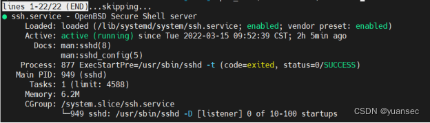

安装先检测是否已经[安装SSH](https://so.csdn.net/so/search?q=%E5%AE%89%E8%A3%85SSH&spm=1001.2101.3001.7020)：
```Shell
service ssh status
```

如果出现提示：ssh: unrecognized service 说明没有安装 [openSSH](https://so.csdn.net/so/search?q=openSSH&spm=1001.2101.3001.7020)，则需安装 ssh

SSH 服务器的安装：
```Shell
sudo apt install openssh-server
```

SSH 客户端的安装：
```Shell
sudo apt install openssh-client 
```

再次输入
```Bash
service ssh status
```



出现这些则表示已经安装成功。

接下来打开 ssh
```Shell
service ssh start    ---启动ssh
service ssh stop    ---终止ssh
service ssh restart   ---重启ssh
```

开启后可以输入指令测试状态
```Shell
ps -e |grep ssh
```
